# MY FINANCE

MyFinance - Projeto do Curso de Pós-Graduação em Engenharia de Software da PUC-MG

Grupo 10:
- Braitner
- Gabriella
- Sharley
- Nathália

### **DER - Diagrama e Entidades e Relacionamento**

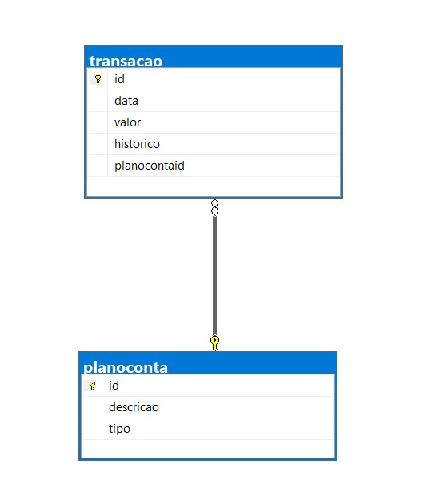

### **Arquitetura**

A aplicação MyFinance utiliza a arquitetura MVC ((Model - View - Controller))  Neste modelo, quando um usuário realiza uma requisição através da interface gráfica (View), a camada de Controller comunica a Model, a qual irá executar a operação e retornar o resultado esperado. Em posse disso, o intermediador (Controller) repassa a informação para a View. Dessa forma, o MVC traz como benefício o isolamento das camadas de negócio e de interface com o usuário, o que propicia maior flexibilidade e possibilidade de reuso das classes.


### **Tecnologias**

* Foi utlizado framework Netcore com C#, 
* banco de dados relacional SQL Server 2019
* Visual Studio (Versão mais recente)
* Última versão do C# extensions, o qual deve ser instalado no Visual Studio Code
* Git e Github

### **Start Projeto**

Acesse o reposítório através do <a href="https://github.com/gabriellaxaviera/myfinance-web">Link</a>

Clique em Code e copie o link.

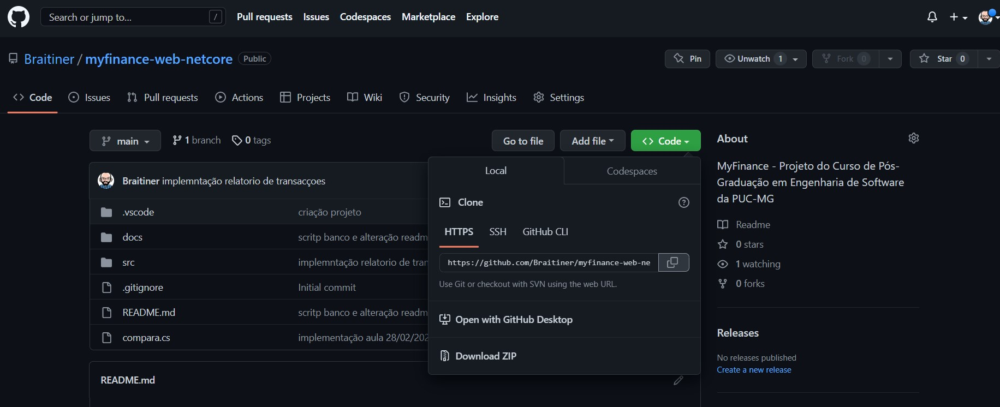

Em sua máquina, clique com botão direito nas pasta que deseja armazenar o projeto e clique em Git Bash Here.

Digite o comando ```git clone https://github.com/gabriellaxaviera/myfinance-web```

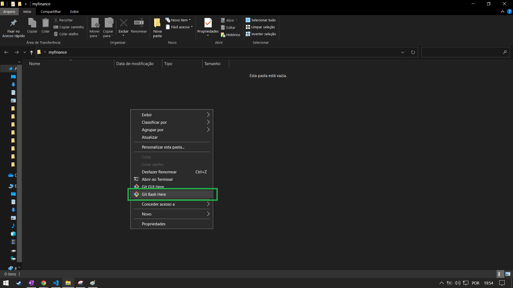
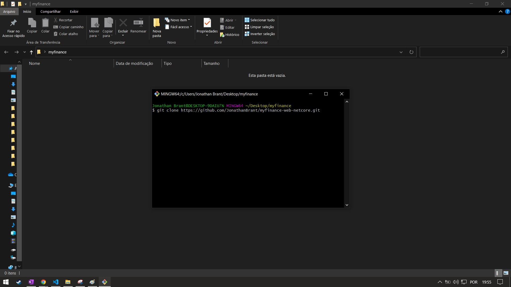

Apos concluir, abrir o VS code e acessar o diretorio onde o projeto foi clonado.

Com projeto aberto no Vs code abrir um Novo terminal e executar o comando ``` cd src``` e em seguida o camndo ```dotnet build``` para compilar o projeto e por ultimo o comando ```dotnet run```  para iniciar o projeto.

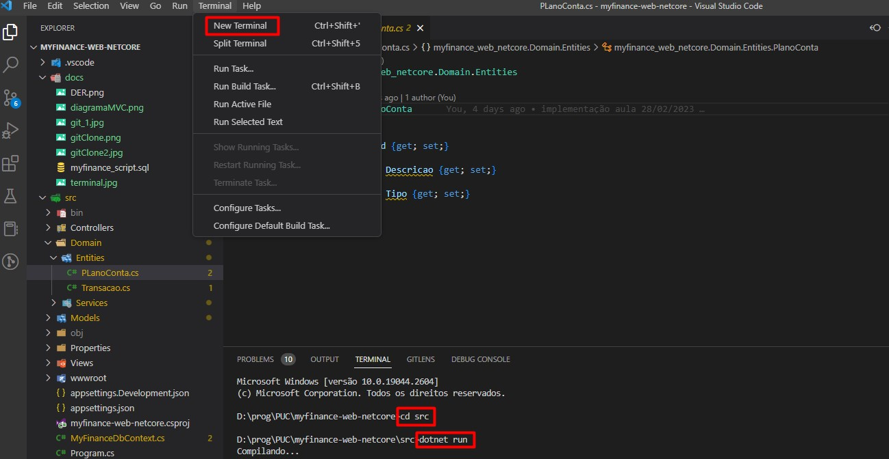

Para acessar a aplicação no navegador copie o caminho indicado e cole no navegador 

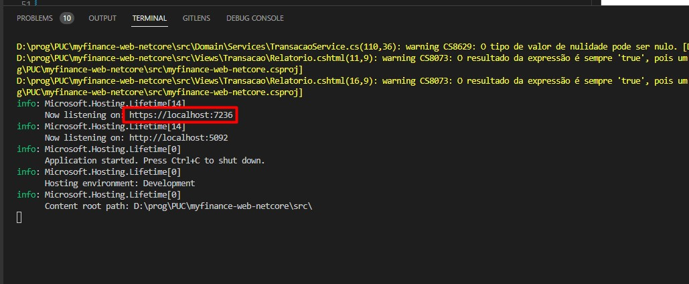

## **Aplicação**

**Tela Inicial**
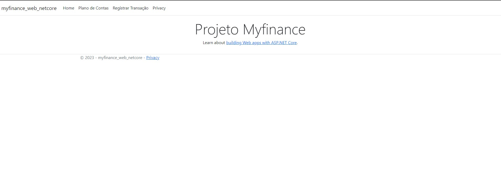

**Tela Plano de Contas**
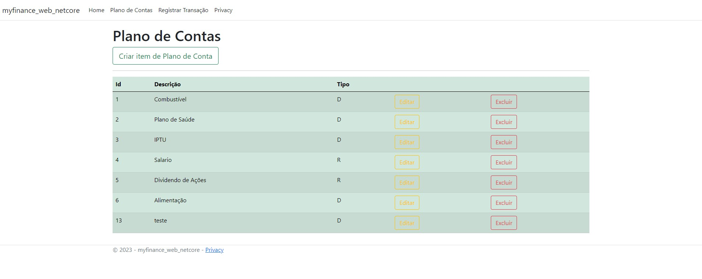

**Tela de Cadastro de Plano de Contas**

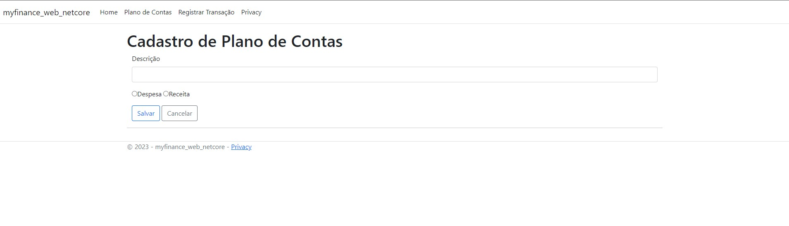

**Tela de Transações**

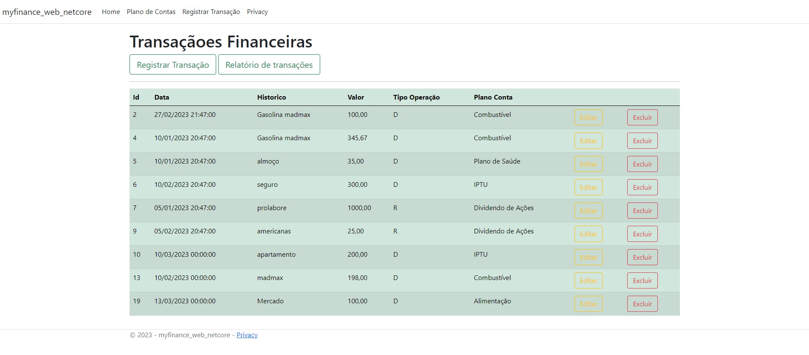

**Tela de Registro de Transações**

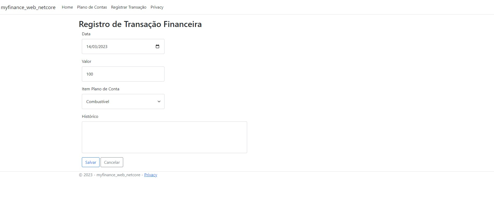

### **Implementação**

 aplicação **MyFinance** foi feita para realização dos controles de registro de  transações  financeiras para assim melhorar a  acuracidade dos pagamentos realizadosE melhor visualização dos relatórios financeiros através dos relatorios implantado no requisito RF103 


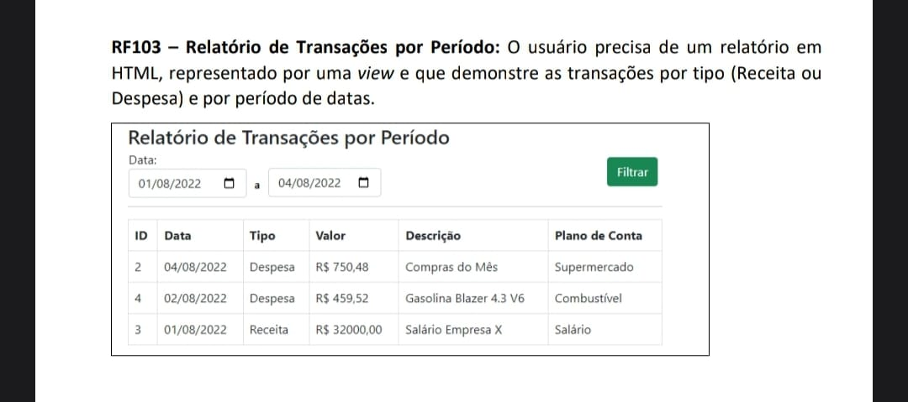

### **Resultado implmentação**

Foi necessario realizar a implementação de acordo com o requisito ***RF103***

**Relatorio por período**
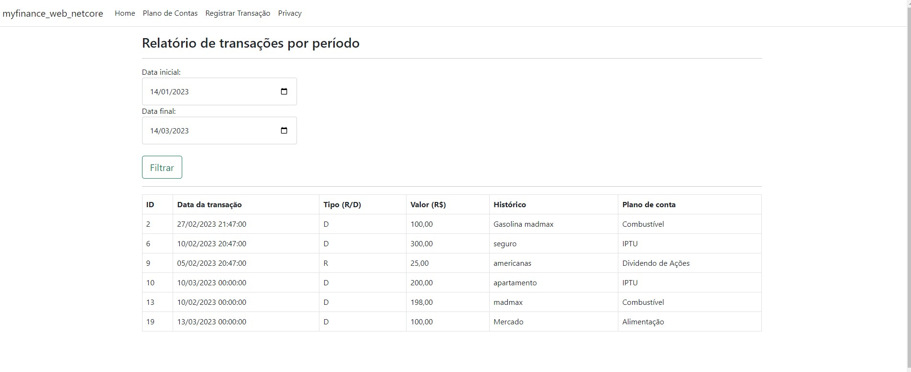